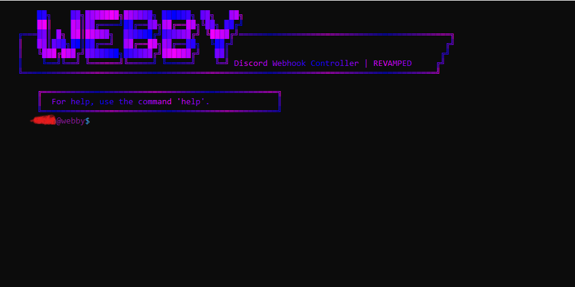

# WebbyRevamped
Webby is here, and revamped! The UI has been styled completely in a new way.

Webby is a Discord webhook controller intended for **educational** and **ethical** purposes only and not for malicious intent.


# DISCLAIMER
```Webby and its developers do not condone, encourage, or support any unethical, uneducational, or malicious use of this program. This software is intended solely for ethical, educational, and legitimate purposes. Any misuse, including but not limited to unauthorized access, exploitation of vulnerabilities, spamming, harassment, or any other activities that violate legal, ethical, or moral guidelines, is strictly prohibited. By using this program, you acknowledge that you are responsible for your actions and agree to comply with all applicable laws and regulations. The developers disclaim any liability for damages or consequences resulting from improper use. Use this tool responsibly.```

# PREVIEW

```Username censored for privacy purposes```

# How do I download Webby?
First ensure that you have python installed using the command ```python --version```

If you don't have python, get it [here](https://www.python.org/downloads/)

Go to [Webby](https://github.com/64bit-lunarteam/WebbyRevamped/blob/main/Webby/webbyrevamp.py). and in the top right corner, press ```Download raw file```. Now, you have Webby!

